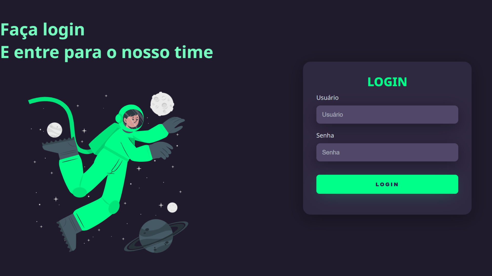

# Login

## Projeto 💻
Projeto desenvolvido por meio de um vídeo no YouTube do canal do Markzuel.
- YouTube: [TELA DE LOGIN COM TEMA DARK | HTML + CSS](https://youtu.be/69-WfrVBli8?si=ygQNbDmxmPe6CzN-)

## Instalação 🛠
Siga esses passos para instalar o repositório:
1. Rode `git clone https://github.com/dudaishiyama/Login` para fazer um clone desse repositório.
2. Abra o arquivo HTML.

## Tecnologias 🚀
As tecnologias utilizadas nesse projeto são:
- HTML
- CSS
- Google Fonts

## Créditos ❤️
Feito por [Duda Ishiyama](https://github.com/dudaishiyama/).